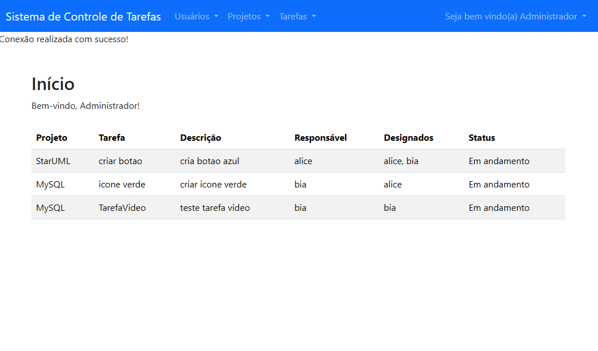

# Sistema de Gestão de Tarefas, Projetos e Membros

Este é um projeto desenvolvido em PHP com uso de Bootstrap para a interface, com foco em um sistema de gerenciamento de tarefas, equipes e membros. O sistema foi implementado com base nos princípios da programação orientada a objetos (POO).

Este projeto foi realizado como entrega final da disciplina Linguagem de Programação IV, do curso de Análise e Desenvolvimento de Sistemas da FATEC Presidente Prudente.

# Funcionalidades
Cadastro e gerenciamento de membros

Criação e edição de equipes

Gerenciamento de tarefas atribuídas a membros e equipes

Interface responsiva com Bootstrap

Estrutura de código orientada a objetos

# Tecnologias Utilizadas
PHP (backend)

MySQL (banco de dados)

Bootstrap (frontend)

HTML5 / CSS3 /

## 🖼️ Tela Principal

